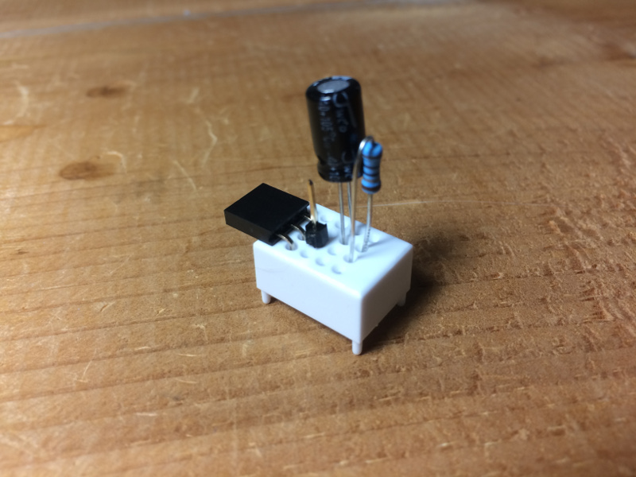
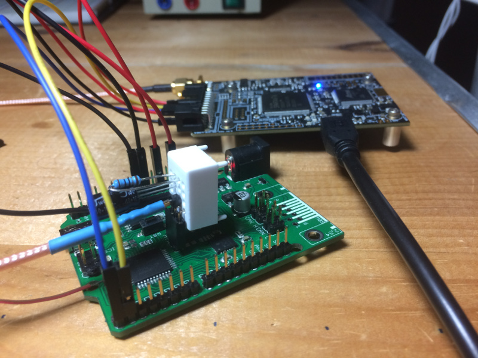

# [It's a Kind of Magic](https://rhme.riscure.com/3/challenge?id=10), solution 1

Side Channel Analysis - 200pts

## Challenge text

You managed to get a spare key fob for the car you like. However you want to duplicate it so that you can maintain your access to it. Through extensive reverse engineering, you figure out that the device accepts an input challenge performs AES-128 encryption (or decryption) and returns the response. It is also identified that the device operates on masked input and returns masked output. Extract the key so you can get free rides!

The device expects 18 bytes of input: the first byte should be either 0xAE (for encryption) or 0xAD (for decryption) followed by 16 bytes of data, followed by a newline.

## Solution

### Solution overview

This solution is based on the assumption that the mask is a semi-random 128 bit number that is XORed with both the input prior to the cipher block and the output after the cipher block.

The leakage model for the key should therefore be:

	SboxOutput = sbox(PT_byte ^ mask_byte ^ key_byte)
	or equivalently as: SboxOutput = sbox(PT_byte ^ masked_key)

This solution also relies on the lack of padding used by the encryption/decryption process, which can be leveraged to reveal the mask by using carefully crafted input.

This will be a three stage attack:
* Perform a CPA attack on the sbox output to reveal the masked key.
* Perform an attack to reveal the mask.
* XOR the mask with the masked key to reveal the key itself.

### Hardware setup

This solution is based on using the [ChipWhisperer Lite](https://newae.com/tools/chipwhisperer/).

If you haven't done so already, prepare the RHme3 board for side channel analysis according to the [RHme3 board preparation](../Preparation/RHme3_board_prep.md) guide.

Replace the jumper at JP4 with a 4x4 breadboard, wired as follows:
* Measurement pin at UC
* 10 Ohm thin film shunt resistor from UC to Vcc
* 100 uF capacitor from Vcc to Gnd
* Breadboard UC to RHme-UC (via header extension)
* Breadboard Vcc to RHme-Vcc (via header extension)
* Breadboard Gnd to RHme-Gnd

Connect the ChipWhisperer Lite (CWL) to the RHme3 board as follows:
* CWL-Gnd to RHme-Gnd
* CWL-3V3 to RHme-3V3
* CWL-Vref to RHme-IOref
* CWL-IO1 (as TX) to RHme RX
* CWL-IO2 (as RX) to RHme TX
* CWL-measure to Measurement pin on 4x4 breadboard.

The complete setup should look like this.

### Analysis

* The CPU clock rate is 16 MHz based on viewing clocking artifacts in SPA.  The ADC clock should be run at 64 MHz (four times the CPU clock).
* Software crypto is assumed.  According to the XMEGA AU Manual [1], the XMEGA AES crypto module takes 375 cycles of the peripheral clock to complete one block of AES encryption.  With an ADC clock running at 64 MHz, a single block of encryption should take 1500 ADC samples.  One block as viewed in SPA takes far more ADC samples than this, so hardware crypto is probably not used.
* A 10 Ohm shunt resistor seems to be the largest value that doesn't cause the RHme3 board to constantly reset.
* The ChipWhisperer Lite seems to provide the cleanest power among many sources tried.
* Encrypted messages can be decrypted back to the original messages up until the RHme3 board is reset.  A new mask is assumed to be randomly selected every time the board is reset.  Because of this, the entire attack must take place without resetting the board.
* Message that include a value of 0x0A in any byte position will fail to encrypt/decrypt properly.  This will be misinterpreted as a newline character and will shorten the message.  It is assumed that only the message up to and including the newline byte is encrypted/decrypted, along with anything remaining in the buffer after the newline.
* Messages that are shorter than 16 bytes behave similarly.
* Additional testing reveals that padding is not used, and when a message shorter than 16 bytes or a message with a newline byte is used a portion of the previous message following the newline byte is revealed.  With a message of all zeros, we can exploit this to leak part of the mask.

### Attack Stage 1: Reveal the mask

The lack of padding results in a condition in which most of the mask can be leaked when the device is given a message shorter than 16 bytes.

The general process is as follows:
* Encrypt a plaintext of all zeros.  These will be XORed with the mask prior to encryption.  The XORed plaintext, which is really just the mask itself at this point, will remain in the input buffer.
* Encrypt a blank message.  The actual plaintext will be the newline and null string terminator [0x0A,0x00] and bytes 2 thru 15 of the mask which are still sitting in the input buffer.
* Note: If the ciphertext includes any bytes with a value of 0x0A, decryption will fail due to the input being cut short by the newline.  If this happens, you have to reset the RHme3 board and start over from the first step.
* Decrypt all but the first two bytes of the mask.

The following Python3 script accomplishes this stage of the attack.

	import serial

	port = 'COM42'
	rate = 115200

	s = serial.Serial(port,rate,timeout=3.0,write_timeout=3.0,inter_byte_timeout=3.0)

	def dump(l):
		return '[0x' + ',0x'.join([format(a,'02x') for a in l]) + ']'

	def read_until_empty():
		message = list()
		while (True):
			data = s.read(1)
			if (len(data) > 0):
				message += list(data)
			else:
				break
		return message

	def write(message):
		s.write(bytes(message))

	def enc(pt,trim=0):
		write([0xAE] + pt + [0x0A])
		echo = read_until_empty()
		l = len(echo)
		ct = echo[l - 16 - trim:l - trim]
		return ct

	def dec(ct,trim=0):
		write([0xAD] + ct + [0x0A])
		echo = read_until_empty()
		l = len(echo)
		pt = echo[l - 16 - trim:l - trim]
		return pt

	# Step 1: Load mask into input buffer.
	pt1 = [0x00 for a in range(16)]
	# Setting any bit in pt will swap the state of the corresponding bit in the result.
	# This indicates/confirms that XOR is used to add the mask to the input.
	#pt1[8] = 0x01
	ct = enc(pt1)

	# Step 2: Leak input buffer.
	pt1 = [0x0a]
	ct = enc(pt1,1)
	if 0x0A in ct:
		print('Result includes newline.  Reboot and try again.')
	else:
		pt2 = dec(ct)
		leak = pt2[2:16]
		print(dump(leak),'\n')

### Attack Stage 2: Reveal the masked key

*Note: Remember not to reset the RHme3 board now or at any time during the CPA attack.  Doing so will reset the mask and you'll have to redo the entire attack from the start.*

This is a straightforward CPA attack using the ChipWhisperer Lite.

Since the device uses binary data instead of ASCII data, a custom target module called BinarySerial.py needs to be created to handle this.  This module is fairly easy to create by copying the SimpleSerial.py module and making a few changes in how it handles data.  In addition, BinarySerial.py should also reject any plaintext that includes a newline (0x0A) embedded in the data.

The traces were collected using the following parameters:
* ADC clock: 64 MHz
* Gain: High, 25
* Trigger: Low, based on IO1 (TX)
* Go Command: \xAE$TEXT$\n
* Output Format: \xAE$TEXT$\n$RESPONSE$
* Baud: 115200
* Trigger offset and total samples are initially broad and then carefully zoomed into the area of concern.
* Number of traces: 300

Analysis was performed using the following parameters:
* Preprocessing: SAD alignment, focused at varying points around the area assumed to be sbox substitutions
* Preprocessing: digital filter, Butterworth, Type low, Critical Freq 0.6, Order 5
* Hardware Model: Hamming Weight: AES SBox Output, First Round (Enc)

All sixteen masked key bytes were successfully recovered using this process.  Following are screenshots showing the CPA attack process in ChipWhisperer Analyzer.

First round encryption showing areas of interest:

Attack the first round Sbox:

Sbox correlations over time:

Sbox correlations versus traces:

Results showing masked key bytes:

Adjust alignment and reattack to get the first byte.

### Attack Stage 3: Extract the key

*Note: Remember not to reset the RHme3 board until after you get a known ciphertext.  Doing so will reset the mask and you'll have to redo the entire attack from the start.*

The following Python3 script brute forces the first two bytes of the mask and recovers the key.  To do this, an implementation of AES is needed in which you can encrypt a single block of 16 bytes without padding.  I have my own implementation of AES that for export control reasons I cannot share.  I used my own because the state of AES implementations in Python3 is not happy.  Your mileage may vary.

Note: It is strongly recommended that you **do not implement** your own crypto for production code.  However, I recommend that you **do implement** your own crypto for instructional and analytic purposes.  You will learn a lot from doing so and have the benefit of CTF-ready crypto that is completely under your control.

	import sys
	sys.path.append("E:\\Tech\\mylib")
	from myaes import AES

	def dump(l):
		return '[0x' + ',0x'.join([format(a,'02x') for a in l]) + ']'

	# Step 1: Establish what is known from the previous attack stages (bytes 2 thru 15).
	known_mask = [0x26,0x35,0x0c,0xe7,0x4d,0x77,0x33,0xbc,0x6f,0x73,0x38,0x67,0x0b,0x6b]
	masked_key = [0x5d,0x98,0xc2,0x6f,0xf9,0x9c,0xa3,0xf9,0xd6,0xc5,0x7a,0x06,0xed,0x24,0xe9,0x0c]
	known_key = [p ^ q for p,q in zip(masked_key[2:16],known_mask)]

	# Step 2: Encrypt all zero message on RHme3 board to establish a known ciphertext.
	known_ciphertext = [0x27,0x8d,0x9e,0x23,0x74,0xd3,0x41,0x06,0xdb,0x84,0x83,0xdc,0x60,0x19,0x75,0x32]

	# Step 3: Replicate the encryption process, but brute force the first two mask bytes
	#   until the ciphertext matches.
	a = AES(128)
	for mask_byte0 in range(256):
		print('mask byte 0:',hex(mask_byte0))
		for mask_byte1 in range(256):
			test_mask = [mask_byte0,mask_byte1] + known_mask
			test_key = [masked_key[0] ^ mask_byte0,masked_key[1] ^ mask_byte1] + known_key
			# Skipped a step here: Assume masked all zero input is same as the mask itself.
			test_ciphertext = a._crypt(test_mask,test_key,False,'ECB',None,False)
			masked_ciphertext = [p ^ q for p,q in zip(test_ciphertext,test_mask)]
			if (masked_ciphertext == known_ciphertext):
				print('Mask:',dump(test_mask))
				print('Key: ',dump(test_key))
				sys.exit()

And finally, here's the script output with the resulting mask and key.

	$ python3 get-mask-myaes.py
	mask byte 0: 0x0
	mask byte 0: 0x1
	mask byte 0: 0x2
	mask byte 0: 0x3
	mask byte 0: 0x4
	mask byte 0: 0x5
	mask byte 0: 0x6
	...
	mask byte 0: 0x56
	mask byte 0: 0x57
	mask byte 0: 0x58
	mask byte 0: 0x59
	mask byte 0: 0x5a
	mask byte 0: 0x5b
	Mask: [0x5b,0x0b,0x26,0x35,0x0c,0xe7,0x4d,0x77,0x33,0xbc,0x6f,0x73,0x38,0x67,0x0b,0x6b]
	Key:  [0x06,0x93,0xe4,0x5a,0xf5,0x7b,0xee,0x8e,0xe5,0x79,0x15,0x75,0xd5,0x43,0xe2,0x67]

## References

1. [8-bit Atmel XMEGA AU Microcontroller XMEGA AU MANUAL, 04/2013](http://ww1.microchip.com/downloads/en/DeviceDoc/Atmel-8331-8-and-16-bit-AVR-Microcontroller-XMEGA-AU_Manual.pdf)
