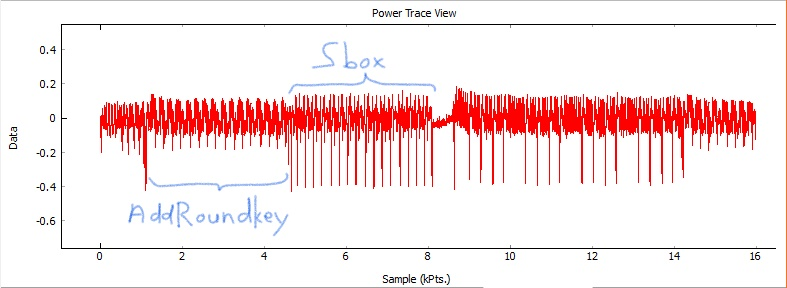
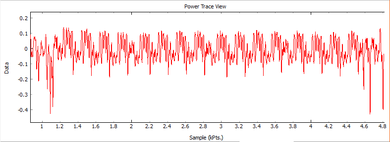
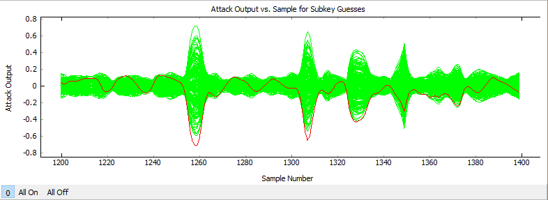
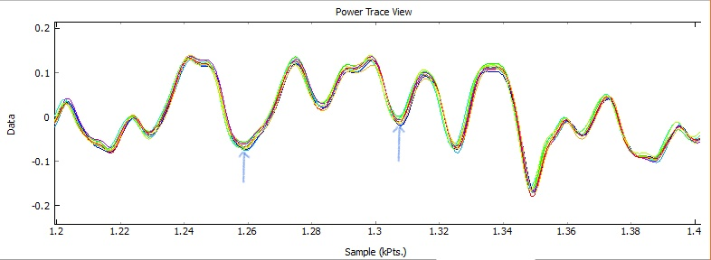
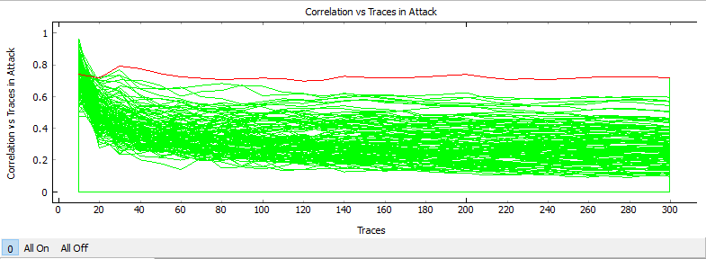

# [It's a Kind of Magic](https://rhme.riscure.com/3/challenge?id=10), solution 2

Side Channel Analysis - 200pts

## Challenge text

You managed to get a spare key fob for the car you like. However you want to duplicate it so that you can maintain your access to it. Through extensive reverse engineering, you figure out that the device accepts an input challenge performs AES-128 encryption (or decryption) and returns the response. It is also identified that the device operates on masked input and returns masked output. Extract the key so you can get free rides!

The device expects 18 bytes of input: the first byte should be either 0xAE (for encryption) or 0xAD (for decryption) followed by 16 bytes of data, followed by a newline.

## Solution

This solution is mostly the same as [solution 1](It's_a_Kind_of_Magic_solution_1.md).  The only difference is in how we get the mask.

### Solution overview

Follow all of the steps in solution 1, except to replace the first and last stages of attack as follows.

The mask has the same leakage model as a key would normally have as the output of AddRoundKey.  It is simply XORed with the plaintext.  In other words, these two models are the same:

	Normal encryption: HW:AddRoundkey = hamming_weight(pt_byte ^ key_byte)
	This challenge:    HW:AddRoundkey = hamming_weight(pt_byte ^ mask_byte)

So HW:AddRoundkey can be used to reveal the mask.

However, to make the attack work careful attention needs to be placed on alignment and limiting the range of the attack.

### Attack Stage 1: Reveal the mask

Here's the procedure using ChipWhisperer Analyzer:

Set up a CPA attack for AES-128 as you normally would, then make these adjustments:
* Set the Hardware Model to HW: AddRoundKey Output, First Round (Enc).
  * Note: We're actually attacking the input to AddRoundKey, but it's the right leakage model for recovering the mask.
* Apply rough alignment using sum of difference on the three large peaks prior to the AddRoundKey section.
* Apply a digital filter: Butterworth, low pass, critical frequency 0.25, order 5.

Then attack each individual byte (N) of the mask as follows:
* Apply fine alignment (any algorithm is okay) focused around where the Nth byte of AddRoundKey is processed.
* Limit the attack range only to where the Nth byte of AddRoundKey is porcessed.
  * Note: If needed, Output vs Point Plot can help you find the right area to focus on.
* Attack only the Nth subkey
* Perform the attack.
* The attack result will give you a pair of byte values with the same correlation.  Incidentally, these two values are one's complements of each other (bitwise complements).  Determine which is the correct mask byte value as follows:
  * Choose one of these values and enter it in the Nth position of Results>Highlighted Key>Override.
  * Rerun the attack.
  * Display the Nth byte in Output vs Point Plot.  The red line represents the byte value entered into the known key.  If it peaks into negative correlations, then you have the correct mask byte value.  If the red line peaks into positive correlations, the other value is the correct mask byte value.

All sixteen mask bytes were successfully recovered using this process.  Following are screenshots showing the CPA attack process in ChipWhisperer Analyzer.

First round encryption showing areas of interest:

Attack the first round AddRoundkey:

AddRoundkey byte 0 correlations over time:

AddRoundkey trace with byte 0 points of interest:

AddRoundkey byte 0 correlations versus traces:

Results showing mask byte 0:

### Attack Stage 3: Extract the key

Once the mask and masked key have both been recovered, simply XOR them together to recover the key itself.
