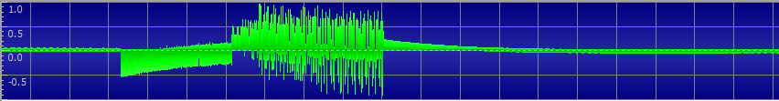
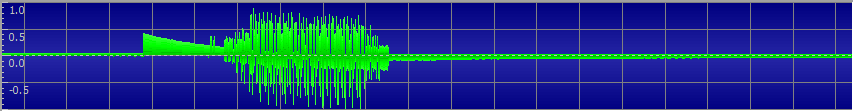

# Phonic Frenzy 1

Miscellaneous - 100pts

## Challenge text

Your car has a brand new infotainment center. In order to activate the system you have to register the serial number on the company's website. The only problem is, it's not trivial to find the dang thing.

## Tools used

Saleae Logic 8 USB logic analyzer/oscilloscope

## Solution

Probe each IO pin in turn using the Saleae in both analog and digital modes to detect signals.

Various digital signals are found on pins A0 thru A5.

Analog signals are found on pins D7 and D8.  The signals look identical.

When D7 is plugged into a powered speaker, a message is heard giving the flag.  It's difficult to discern some of the hex digits spoken by the synthetic voice.  However, this can be resolved in two ways:
1. Record the analog signal and visually catalog the shape of the amplitude envelope for each hex digit.  As it turns out, A and 8 are the most difficult hex digits to discern audibly.  However, it's very easy to see the plosive T at the end of the amplitude envelope for 8.  That makes it easy to discern from A, which lacks that feature.
2. Brute force.  There are only sixteen possibile digits, and with thorough analysis the digits will become mostly apparent.  If you have trouble resolving the last few digits, you can try each possible flag.  So for example, if there are two remaining unidentified digits, each of which can be one of six possible values, there will be 6*5 ==> 30 possible flags.

## Visual catalog

These are all of the hex digits that were included in my flag.  Missing are: 4, 6, E and F.

"Zero"

"One"

"Two"

"Three"

"Five"

"Seven"

"Eight"

"Nine"

"Aee"

"Bee"

"Cee"

"Dee"

