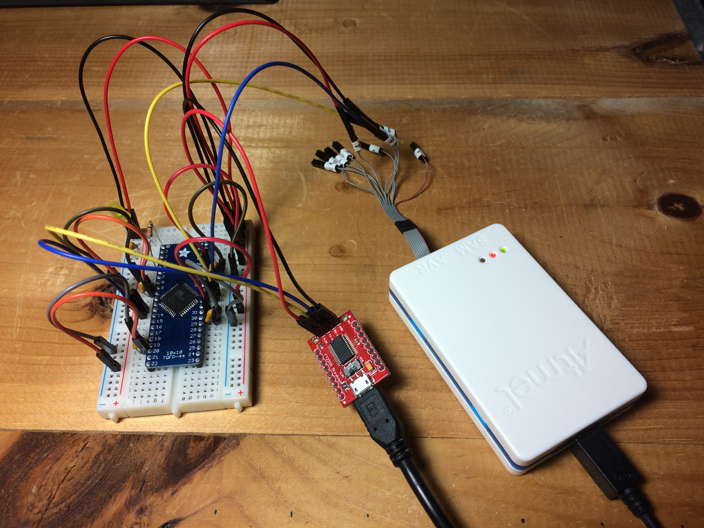

# [Ransom 2.0](https://rhme.riscure.com/3/challenge?id=22)

Reverse Engineering - 150pts

## Challenge text

In theory, this firmware mod was supposed to give you 30% extra horsepower and torque. In reality, it's something different. For real this time.

## Solution

### Overview 

The solution to this challenge depends on two things:
* Find a unique feature of your device that the unlock code is based on.
* Set up an alterate device that can be used to generate unlock codes.  This should be another MCU of the same type (XMEGA-A4U), programmed with the unencrypted binary, and under hardware debugger control.

Once these two things are in hand, the solution is to reverse engineer the unique device feature from the rhme3 board and feed it into the alternate device to generate the unlock code.

### Debugging setup

For this solution, you will need another AVR XMEGA-A4U and a hardware debugging setup.
* XMEGA-A4U chip on TQFP-44 breakout board
* Atmel ICE PDI programmer
* Atmel Studio 7
* 3.3V USB to serial adapter

The only discrete components needed for wiring up the MCU are four 100 pF decoupling capacitors.  Anything else you wish to add is optional (e.g. blinky lights).  A crystal/resonator is not needed.  The Riscure challenge uses the internal oscillator on the MCU.

You'll need to connect the following pins on the XMEGA:
* 8,18,30,38: GND
* 9,19,31,39: 3V3
* 12: USARTC0 RX
* 13: USARTC0 TX
* 34: PDI Data
* 35: PDI CLock

You'll need to connect the following pins on the Atmel ICE:
* 2: GND
* 3: PDI Data
* 4: Vref (connected to 3V3: sensing, not supplying voltage)
* 6: PDI CLock

The pinout is given in section 2 of the XMEGA A4U Datasheet [1].

Here's what it should look like when you put it all together.

Note: An article describing how to load an unencrypted HEX binary into Atmel Studio 7 and run a hardware debugging session is pending.

### Analysis

Load the encrypted binary onto the RHme3 board, and it gives a user ID (such as 383532071F001200).

	Your car is taken hostage by REVENANTTOAD ransomware version DEBUG_a4fae86c.
	To get your car back, send your user ID:
	383532071F001200

	and $1337 to the following rhme3coin address:
	[CENSORED].

	Already paid? Then enter the received unlock code here:

Load the unencrypted binary onto the XMEGA-A4U device that you control, and it gives a different user ID (such as 3439350305001500).

Analyze the unencrypted binary on the device under your control using a PDI programmer, and view the production sigantures of the chip.  These are fully described in section 4.17 of the XMEGA AU MANUAL [2].  Examine the following components of the production signature:

	Registers 3-5 of the lot number: 0x343935
	Wafer number: 0x03
	Coord X: 0x0500
	Coord Y: 0x1500

A careful look reveals that these are all of the bytes of the user ID.

### Attack

Decode the user ID from the RHme3 board as follows:

	Registers 3-5 of the lot number: 0x383532
	Wafer number: 0x07
	Coord X: 0x1F00
	Coord Y: 0x1200

Now you have the production signature bytes for the RHme3 board.

Perform all of the following with the unencrypted binary on a device under your control:
* Set a data breakpoint on one of the production signature memory locations (0x0D66) and run the debugger up to that point.
* Single step until all of the production signature bytes are copied into RAM (at 0x3FD4-0x3FDE).
* Manually overwrite the production signature bytes in RAM with the production signature bytes decoded from the RHme3 board user ID.
* Continue the debugger.  The device under your control will calculate the unlock code for the RHme3 board.

Now enter the unlock code into the RHme3 board and get the flag.  It couldn't have been easier.

	Your car is taken hostage by REVENANTTOAD ransomware version DEBUG_a4fae86c.
	To get your car back, send your user ID:
	383532071F001200

	and $1337 to the following rhme3coin address:
	[CENSORED].

	Already paid? Then enter the received unlock code here:
	267EDED9BE542791601214F44DB3ED59
	It was a pleasure doing business with you.
	Your car is now unlocked.
	Here is a bonus:
	b1d309991532028843c5f80f0d32de0a
	Have a nice day!

## References

1. [8/16-bit Atmel XMEGA Microcontroller XMEGA A4U Datasheet, 09/2014](http://ww1.microchip.com/downloads/en/DeviceDoc/Atmel-8387-8-and16-bit-AVR-Microcontroller-XMEGA-A4U_Datasheet.pdf)
2. [8-bit Atmel XMEGA AU Microcontroller XMEGA AU MANUAL, 04/2013](http://ww1.microchip.com/downloads/en/DeviceDoc/Atmel-8331-8-and-16-bit-AVR-Microcontroller-XMEGA-AU_Manual.pdf)
