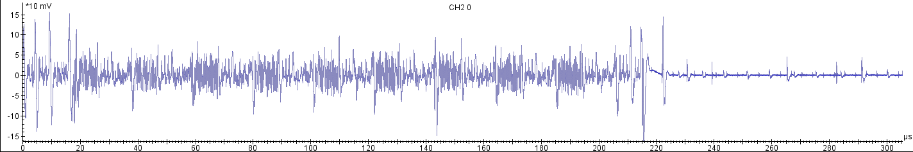

# Tracing the Traces (Qualifying Round)

Side Channel Analysis - 1pt

## Challenge text

These traces (.trs and .mat format) were captured from a hardware device performing a certain cryptographic calculation. The trace files contain input/output data as well as the corresponding power measurements for (part of) the cryptographic operation. Can you get the key?

## Solution

### Recon

I'm not familiar with the .trs file format.  Maybe this has something to do with Riscure?  Googling "riscure trs format" returns [GitHub - Riscure/Jlsca: Side-channel toolkit in Julia](https://github.com/Riscure/Jlsca).  Perhaps it's best if we use this tool?

### Analysis

A quick peek at the provided image indicates ten rounds of activity, so this is possibly AES-128.

### Attack

Download and install Julia 0.6.

Open the Julia REPL and install Jlsca as follows:

	Pkg.clone("https://github.com/Riscure/Jlsca")

A basic correlation attack can be performed using the script Jlsca\examples\main-noninc.jl.  However, the traces need to be aligned first.  Uncomment the alignment pass section, and adjust maxShift and referenceOffset as needed.

	# # example alignment pass
	maxShift = 1000
	referenceOffset = 1000
	reference = trs[1][2][referenceOffset:referenceOffset+5000]
	corvalMin = 0.4
	alignstate = CorrelationAlignFFT(reference, referenceOffset, maxShift)
	addSamplePass(trs, x -> ((shift,corval) = correlationAlign(x, alignstate); corval > corvalMin ? circshift(x, shift) : Vector{eltype(x)}(0)))

Run the script and get the key as follows:

	>julia examples\main-noninc.jl traces.trs

	kb: 1
	rank:   1, candidate: 0xca, peak: 0.617362 @ 2583
	rank:   2, candidate: 0xf9, peak: 0.261922 @ 2591
	rank:   3, candidate: 0xaf, peak: 0.249401 @ 1353
	rank:   4, candidate: 0xec, peak: 0.249189 @ 3244
	rank:   5, candidate: 0xe6, peak: 0.246542 @ 1541
	kb: 2
	rank:   1, candidate: 0xfe, peak: 0.529279 @ 1765
	rank:   2, candidate: 0x71, peak: 0.310908 @ 683
	rank:   3, candidate: 0x73, peak: 0.257934 @ 2210
	rank:   4, candidate: 0x50, peak: 0.253981 @ 1774
	rank:   5, candidate: 0x61, peak: 0.248898 @ 4686
	kb: 3
	rank:   1, candidate: 0xba, peak: 0.658264 @ 2479
	rank:   2, candidate: 0xbc, peak: 0.281169 @ 2414
	rank:   3, candidate: 0xe8, peak: 0.270218 @ 1813
	rank:   4, candidate: 0x01, peak: 0.268490 @ 1952
	rank:   5, candidate: 0xac, peak: 0.267582 @ 2477
	kb: 4
	rank:   1, candidate: 0xbe, peak: 0.560184 @ 2232
	rank:   2, candidate: 0x76, peak: 0.251812 @ 4420
	rank:   3, candidate: 0xc6, peak: 0.249379 @ 4802
	rank:   4, candidate: 0xf3, peak: 0.245871 @ 2580
	rank:   5, candidate: 0x9f, peak: 0.239127 @ 5072
	kb: 5
	rank:   1, candidate: 0xde, peak: 0.528327 @ 2938
	rank:   2, candidate: 0xf2, peak: 0.274202 @ 5364
	rank:   3, candidate: 0x2d, peak: 0.265815 @ 1765
	rank:   4, candidate: 0x2f, peak: 0.265775 @ 310
	rank:   5, candidate: 0xef, peak: 0.249055 @ 5996
	kb: 6
	rank:   1, candidate: 0xad, peak: 0.542787 @ 1819
	rank:   2, candidate: 0x8e, peak: 0.274633 @ 4678
	rank:   3, candidate: 0x41, peak: 0.274167 @ 1046
	rank:   4, candidate: 0x3c, peak: 0.272090 @ 2747
	rank:   5, candidate: 0x20, peak: 0.254060 @ 299
	kb: 7
	rank:   1, candidate: 0xbe, peak: 0.719162 @ 2499
	rank:   2, candidate: 0xc0, peak: 0.249851 @ 2185
	rank:   3, candidate: 0xdf, peak: 0.246773 @ 2183
	rank:   4, candidate: 0x46, peak: 0.245336 @ 5120
	rank:   5, candidate: 0xed, peak: 0.244853 @ 404
	kb: 8
	rank:   1, candidate: 0xef, peak: 0.533053 @ 2535
	rank:   2, candidate: 0x89, peak: 0.279668 @ 2610
	rank:   3, candidate: 0xe2, peak: 0.257130 @ 4355
	rank:   4, candidate: 0xc3, peak: 0.256173 @ 5500
	rank:   5, candidate: 0x1a, peak: 0.251017 @ 2536
	kb: 9
	rank:   1, candidate: 0x00, peak: 0.533323 @ 3275
	rank:   2, candidate: 0x18, peak: 0.259097 @ 1147
	rank:   3, candidate: 0xaf, peak: 0.251591 @ 1915
	rank:   4, candidate: 0x10, peak: 0.248329 @ 2886
	rank:   5, candidate: 0x5e, peak: 0.248272 @ 2491
	kb: 10
	rank:   1, candidate: 0x01, peak: 0.472056 @ 2455
	rank:   2, candidate: 0x9d, peak: 0.287890 @ 1868
	rank:   3, candidate: 0x08, peak: 0.268293 @ 1154
	rank:   4, candidate: 0x9f, peak: 0.264800 @ 3472
	rank:   5, candidate: 0x83, peak: 0.260994 @ 1882
	kb: 11
	rank:   1, candidate: 0x02, peak: 0.541472 @ 2109
	rank:   2, candidate: 0x59, peak: 0.259531 @ 1154
	rank:   3, candidate: 0x65, peak: 0.259474 @ 1428
	rank:   4, candidate: 0xe0, peak: 0.256373 @ 5671
	rank:   5, candidate: 0x77, peak: 0.254436 @ 3363
	kb: 12
	rank:   1, candidate: 0x03, peak: 0.468212 @ 2341
	rank:   2, candidate: 0x64, peak: 0.319749 @ 4806
	rank:   3, candidate: 0x63, peak: 0.270914 @ 30
	rank:   4, candidate: 0xea, peak: 0.259234 @ 2120
	rank:   5, candidate: 0x20, peak: 0.258980 @ 1372
	kb: 13
	rank:   1, candidate: 0x04, peak: 0.457783 @ 3618
	rank:   2, candidate: 0x7e, peak: 0.270788 @ 2431
	rank:   3, candidate: 0x32, peak: 0.256746 @ 5293
	rank:   4, candidate: 0x18, peak: 0.249826 @ 1303
	rank:   5, candidate: 0x1c, peak: 0.249767 @ 3030
	kb: 14
	rank:   1, candidate: 0x05, peak: 0.487404 @ 1929
	rank:   2, candidate: 0x65, peak: 0.272362 @ 3188
	rank:   3, candidate: 0xde, peak: 0.259638 @ 2015
	rank:   4, candidate: 0x94, peak: 0.255427 @ 5176
	rank:   5, candidate: 0xbd, peak: 0.248990 @ 3487
	kb: 15
	rank:   1, candidate: 0x06, peak: 0.497682 @ 2168
	rank:   2, candidate: 0x96, peak: 0.257238 @ 4668
	rank:   3, candidate: 0x53, peak: 0.253746 @ 1153
	rank:   4, candidate: 0x98, peak: 0.251442 @ 1649
	rank:   5, candidate: 0x68, peak: 0.248793 @ 3836
	kb: 16
	rank:   1, candidate: 0x07, peak: 0.534732 @ 2397
	rank:   2, candidate: 0x71, peak: 0.257853 @ 2385
	rank:   3, candidate: 0x2a, peak: 0.255435 @ 2372
	rank:   4, candidate: 0x7f, peak: 0.252207 @ 2118
	rank:   5, candidate: 0xbd, peak: 0.251233 @ 4013
	recovered key material: cafebabedeadbeef0001020304050607
	recovered key: cafebabedeadbeef0001020304050607
	 20.465481 seconds (10.64 M allocations: 1.818 GiB, 6.93% gc time)

