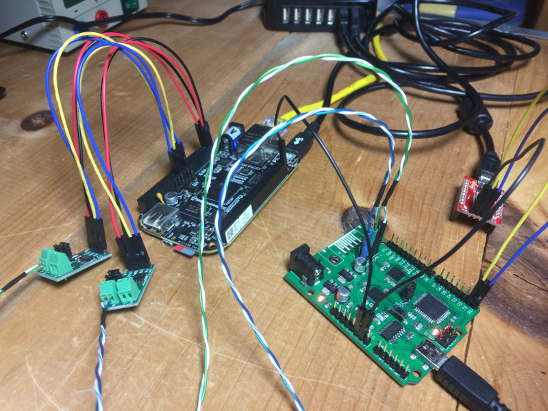

# Beaglebone Black CAN setup

This guide will show you how to get ready for working with CAN bus using your Beaglebone Black (BBB).

## Prerequisites

You will need a Linux version for your BBB with *all* of the following:
* BBB device tree source that matches your kernel version
* Kernel version includes SocketCAN
* Python 3.3
* can-utils package

The BBB includes built-in CAN controllers, but you will need CAN transcievers to handle the wire-level protocol.

For reference, I used the following:
* Kali Linux 2017.01 (a flavor of Debian) with kernel version 4.1.30
* Carloop CAN Hitch (transciever)

## Device tree setup

You'll need to follow this section only if you want to use two CAN interfaces (DCAN0 and DCAN1).  This will disable I2C2 from using pins P9.19 and P9.20, which are needed by DCAN0.  You only need to perform the steps in this section once.

Warning: The configuration in this section will disable BBB capes from working.  Each cape has a small I2C EEPROM that stores info that the BBB needs to know in order to communicate with the cape.  Disable I2C2, and the BBB has no way to talk to cape EEPROMs.  Of course, if you don't use capes then this is not a problem.

Acquire DTS sources that matches your kernel version.  Go [here](https://github.com/beagleboard/linux/) and switch over to the branch that represents your kernel version.  Download the entire branch as a ZIP file.  Extract it and do the following (version 4.1 shown as an example):

	# cd ~/src/linux-4.1/arch/arm/boot/dts/include/
	# rm dt-bindings
	# ln -s ../../../../../include/dt-bindings
	# cd ..
	Edit am335x-bone-common.dtsi and ensure the line with "//pinctrl-0 = <&i2c2_pins>;" is commented out.
	# mv am335x-boneblack.dts am335x-boneblack.raw.dts
	# cpp -nostdinc -I include -undef -x assembler-with-cpp am335x-boneblack.raw.dts > am335x-boneblack.dts
	# dtc -W no-unit_address_vs_reg -O dtb -o am335x-boneblack.dtb -b 0 -@ am335x-boneblack.dts
	# cp /boot/dtbs/am335x-boneblack.dtb /boot/dtbs/am335x-boneblack.orig.dtb
	# cp am335x-boneblack.dtb /boot/dtbs/
	Reboot

## Overlay setup

This section describes how to build the device overlays for the two CAN devices (DCAN0 and DCAN1).  You only need to perform the steps in this section once.

Acquire BBB cape overlays, in one of two ways...

	# apt-get install bb-cape-overlays
	https://github.com/beagleboard/bb.org-overlays/

Then do the following:

	# cd ~/src/bb.org-overlays-master/src/arm
	# ln -s ../../include
	# mv BB-CAN1-00A0.dts BB-CAN1-00A0.raw.dts
	# cp BB-CAN1-00A0.raw.dts BB-CAN0-00A0.raw.dts
	Edit BB-CAN0-00A0.raw.dts and make relevant to CAN0.
	# cpp -nostdinc -I include -undef -x assembler-with-cpp BB-CAN0-00A0.raw.dts > BB-CAN0-00A0.dts
	# cpp -nostdinc -I include -undef -x assembler-with-cpp BB-CAN1-00A0.raw.dts > BB-CAN1-00A0.dts
	# dtc -W no-unit_address_vs_reg -O dtb -o BB-CAN0-00A0.dtbo -b 0 -@ BB-CAN0-00A0.dts
	# dtc -W no-unit_address_vs_reg -O dtb -o BB-CAN1-00A0.dtbo -b 0 -@ BB-CAN1-00A0.dts
	# cp *.dtbo /lib/firmware

## Device setup

Do the following each time you need CAN, or automate these steps if you like.

	# echo BB-CAN0 > /sys/devices/platform/bone_capemgr/slots
	# echo BB-CAN1 > /sys/devices/platform/bone_capemgr/slots
	# cat /sys/devices/platform/bone_capemgr/slots
	# modprobe can
	# modprobe can-dev
	# modprobe can-raw
	# ip link set can0 up type can bitrate 50000
	# ip link set can1 up type can bitrate 50000

Note: There is no consistent mapping between DCAN devices and can interface numbers.  You may end up with DCAN0 mapped to can1.  I haven't found a way to control this behavior.

## Hookup guide

	DCAN0 RX: P9.19
	DCAN0 TX: P9.20
	DCAN1 RX: P9.24
	DCAN1 TX: P9.26

Note: Unlike making UART connections, connect RX on the BBB to RX on a CAN transciever, likewise matching TX to TX.

Wiring CAN bus is beyond the scope of this article.  There are plenty of resources out there that describe how to do this.  It basically involves twisted pair wiring, matching up high and low differential lines, and termination resistors.

Once you get everything connected, it should look something like this.

## Usage

Once you establish a connection, you should be able to test your connection as follows:

	# cansniffer -a can0

If all is good, you should see some CAN traffic.

These are the CAN-related tools that are immediately available on the BBB:

* [SocketCAN/CAN Utils](https://github.com/linux-can/can-utils/blob/master/README.md)
* [Python sockets](http://www.bencz.com/hacks/2016/07/10/python-and-socketcan/)

## References

* [embedded-things.com: Enable CANbus on the Beaglebone Black](http://www.embedded-things.com/bbb/enable-canbus-on-the-beaglebone-black/)
* [electronics.stackexchange.com: Beaglebone Black CAN bus Setup](https://electronics.stackexchange.com/questions/195416/beaglebone-black-can-bus-setup)
