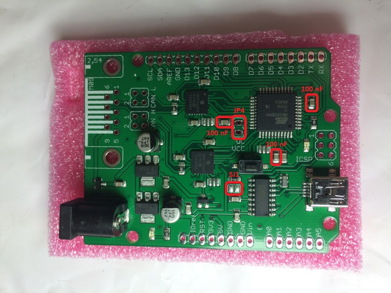
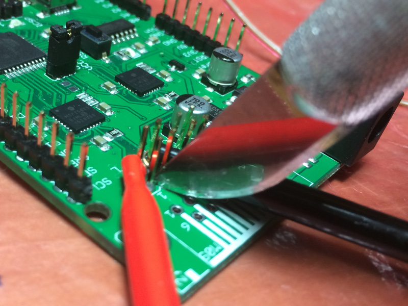

# RHme3 board analysis and preparation

## Chips

* Atmel XMEGA128A4U
* Microchip MCP25625 (x2): CAN controllers/transcievers
* CH340G: USB-Serial adapter

## Resources

* [ATXMEGA128A4U Support](http://www.microchip.com/wwwproducts/en/ATXMEGA128A4U#1)
* [8/16-bit Atmel XMEGA Microcontroller XMEGA A4U Datasheet, 09/2014](http://ww1.microchip.com/downloads/en/DeviceDoc/Atmel-8387-8-and16-bit-AVR-Microcontroller-XMEGA-A4U_Datasheet.pdf)
* [8-bit Atmel XMEGA AU Microcontroller XMEGA AU MANUAL, 04/2013](http://ww1.microchip.com/downloads/en/DeviceDoc/Atmel-8331-8-and-16-bit-AVR-Microcontroller-XMEGA-AU_Manual.pdf)
* [AVR Instruction Set Manual, 11/2016](http://ww1.microchip.com/downloads/en/DeviceDoc/Atmel-0856-AVR-Instruction-Set-Manual.pdf)
* [MCP25625 Support](http://www.microchip.com/wwwproducts/en/MCP25625#1)
* [MCP25625 CAN Controller with Integrated Transceiver Datasheet](http://ww1.microchip.com/downloads/en/DeviceDoc/20005282B.pdf)

## Jumpers

* Arduino Uno R3
* PDI (labeled "ICSP")
* CAN H/L
* SJ1 (solder jumper)
* JP4 (labeled "uC/VCC")

## Notes

Most of the board can be powered by a 3.3V supply, but the MCP25625 requires a 5V supply to operate the transciever circuits.  Running the MCP25625 at 3.3V won't damage it, but CAN won't work.

The XMEGA does not use an external crystal/resonator.  The internal oscillator is assumed to be running at 16/32 MHz.

The XMEGA communicates with the CAN controllers using SPI.

XMEGA does not support ICSP.  The port labeled "ICSP" is actually a PDI port.  You will need a programmer/debugger that supports PDI in order to use this port (e.g. Atmel ICE).  You don't need PDI for the CTF, but this port has extra pins for ground and reset that may be useful.

## Avrdude preparation

Bridge the gap across SJ1 with a blob of solder.  This will connect the DTR pin on the CH340G to the ~RESET pin on the XMEGA.  This will allow avrdude to automatically reset the board to initiate programming.

## CAN preparation

Solder jumper headers at CAN H and CAN L.

To support independant CAN channels, cut the traces connecting the two CAN channels, as follows:
* Using a small screwdriver, gently remove the black header base from the CAN H jumper pins.
* Attach a multimeter across channels 1 and 2 on CAN H.  Put multimeter into tone continuity mode.
* Gently score the CAN H trace between channels 1 and 2 with a hobby knife until the continuity tone stops.
* Put the black header base back onto the jumper pins.
* Repeat all steps with CAN L.

## SCA/FI preparation

Remove the three 100 nF capacitors C7, C16 and C17.

Solder a jumper header at JP4.

Cut the trace connecting the two pins of JP4, as follows:
* Attach a multimeter to both pins of JP4.  Put multimeter into tone continuity mode.
* Turn board over.  The trace to cut is on the back of the board.
* Gently score the trace with a hobby knife until the continuity tone stops.

For normal use: Put a jumper onto JP4.

For SCA/FI: replace the jumper at JP4 with a shunt circuit.
