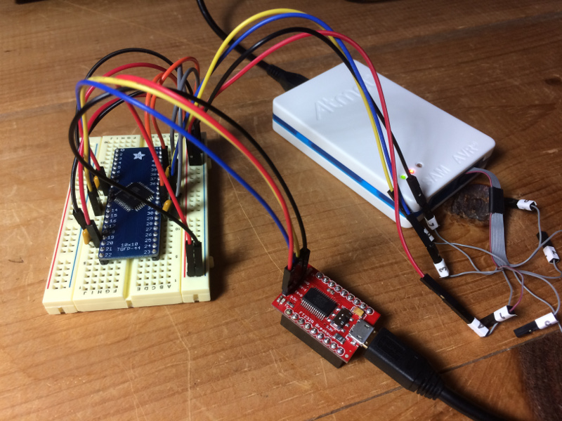
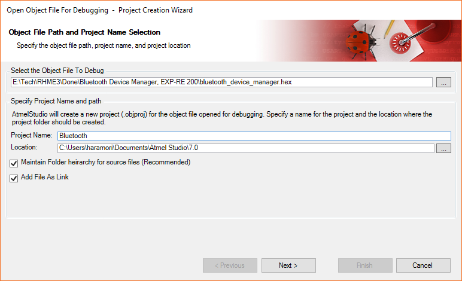
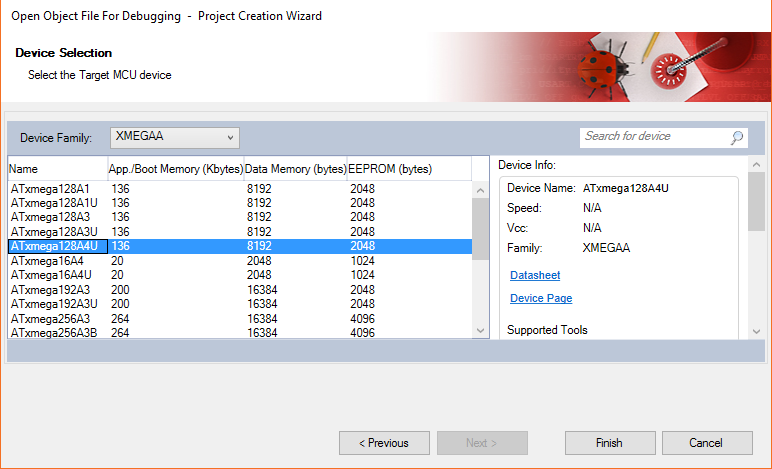
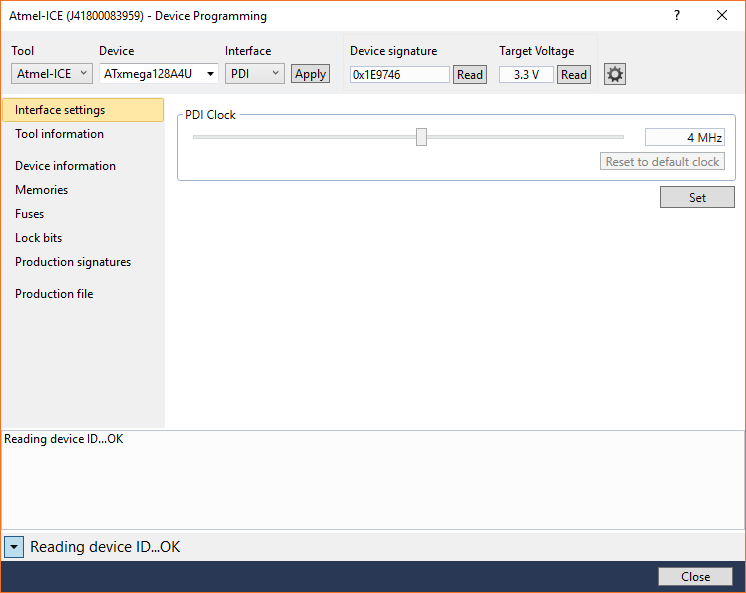
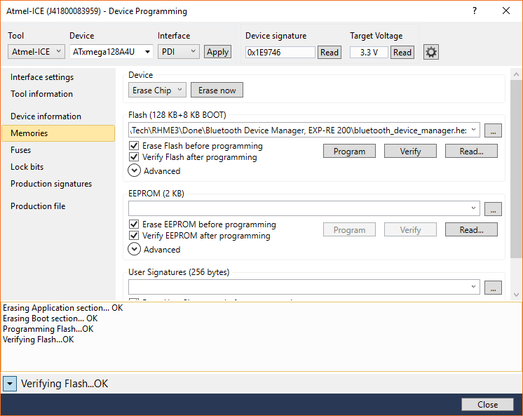
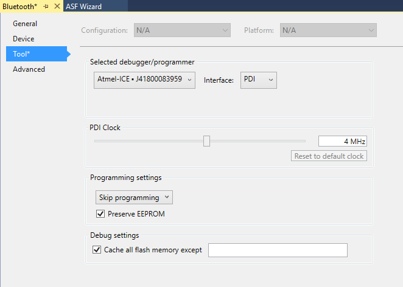

# Debugging AVR XMEGA raw binaries

Why use a simulator when you can use the real thing?  This guide shows how to set up an AVR XMEGA under the control of a hardware debugger, and set up to debug raw binaries on it (stripped of debugging symbols).

## Prerequisites

This guide makes use of the following items:
* Atmel Studio 7
* Atmel ICE (PDI hardware debugger)
* Atmel XMEGA128A4U mounted on TQFP-44 breakout board
* Small breadboard
* 100 nF ceramic capacitors (x4)
* Jumper wires
* 3.3V USB-Serial adapter

If your reversing a binary that requires the use of a crystal, you'll need to add that along with two 22 pF capacitors.  The RHme3 CTF binaries use the XMEGA internal oscillator, so nothing else is needed.

## Hardware setup

These are the pins that you'll use on the XMEGA.  The pinout is given in section 2 of the XMEGA A4U Datasheet [1].
*  8:  Gnd
*  9:  Vcc
* 12:  USARTC0 RX
* 13:  USARTC0 TX
* 18:  Gnd
* 19:  Vcc
* 30:  Gnd
* 31:  Vcc
* 34:  PDI Data
* 35:  PDI CLock
* 38:  Gnd
* 39:  AVcc

Plug your XMEGA breakout board onto a breadboard and make the following connections:
* 100 nF capacitor between each pair of XMEGA pins 8 and 9, 18 and 19, 30 and 31, 38 and 39
* Gnd rail on breadboard to XMEGA pins 8, 18, 30, 38
* 3V3 rail on breadboard to XMEGA pins 9, 19, 31, 39
* USB-Serial Gnd to Gnd rail on breadboard
* USB-Serial 3V3 to 3V3 rail on breadboard
* USB-Serial TX to XMEGA pin 12
* USB-Serial RX to XMEGA pin 13
* Atmel ICE pin 2 to Gnd rail on breadboard
* Atmel ICE pin 3 to XMEGA pin 34
* Atmel ICE pin 4 to 3V3 rail on breadboard (as a voltage reference)
* Atmel ICE pin 6 to XMEGA pin 35

Here's what it should look like when you put it all together.  Other items are optional and depend on the binary that you're debugging.

## Debug setup

Do the following to convert and disassemble a HEX file:

	$ avr-objcopy -I ihex -O elf32-avr demo.hex demo.elf
	$ avr-objdump -D demo.elf > demo.asm

Do the following to load a HEX file into Atmel Studio 7 and debug it on an XMEGA:

1. Create the project as follows:
  * Select the menu item: File > Open > Open Object File For Debugging.
  * Select the HEX file and name the project, then click Next.
  * Select XMEGAA, then select ATxmega128A4U, then click Finish.

2. Program the device as follows:
  * Select the menu item: Tools > Device Programming.
  * Select the following: Tool = Atmel-ICE, Device = ATxmega128A4U, Interface = PDI, then click Apply.
  * Click Read and verify that you get a device signature and the correct target voltage.
  * Go to the Memories tab.
  * Select the HEX file in the flash section, and click Program.
  * Ensure that you get "Verifying Flash...OK", then click Close.

3. Adjust the project for hardware debugging as follows:
  * Select the menu item: Project > Properties.
  * Go to the Tool tab.
  * Select Debugger/Programmer = Atmel-ICE and Interface = PDI.
  * Set Programming settings = Skip programming.

4. Now save your proeject using the menu item: File > Save All.

This process creates a project.  You can use "File > Open > Project/Solution" and "File > Close Solution" to open and close your project.

You may now debug your project.  Select the menu item: "Debug > Start Debugging and Break" to get started.

## References

1. [8/16-bit Atmel XMEGA Microcontroller XMEGA A4U Datasheet, 09/2014](http://ww1.microchip.com/downloads/en/DeviceDoc/Atmel-8387-8-and16-bit-AVR-Microcontroller-XMEGA-A4U_Datasheet.pdf)
